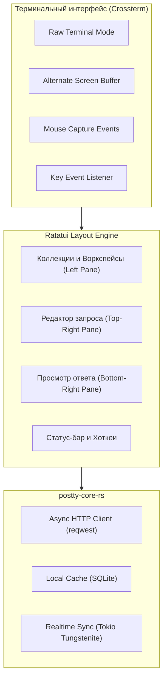
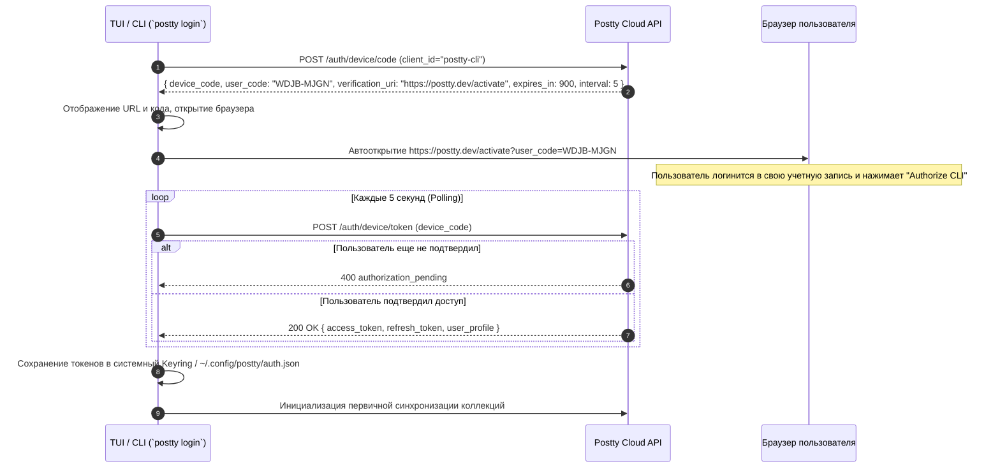
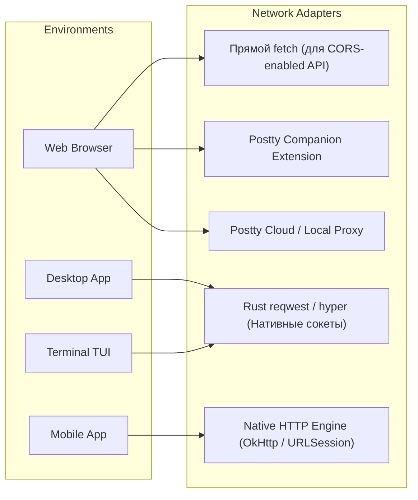
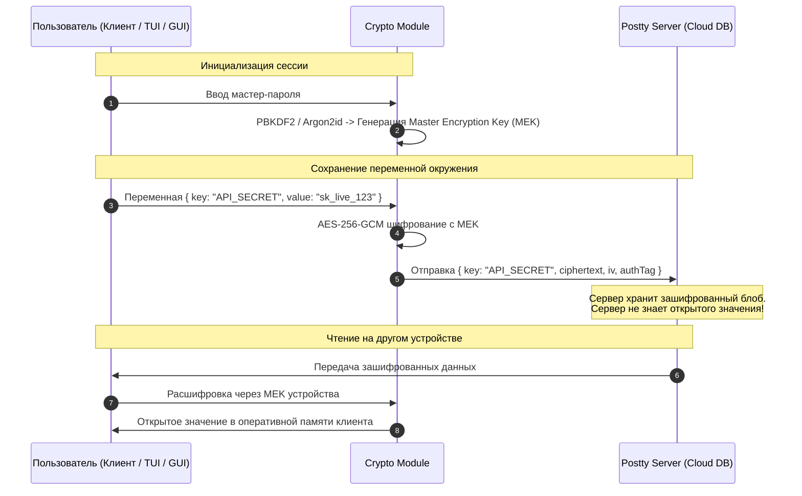

# Архитектура системы Postty

## 1. Обзор системных компонентов

Система строится по модульной архитектуре с единым центром бизнес-логики (`@postty/core` для TS и `postty-core-rs` для Rust), переиспользуемым между всеми клиентскими платформами.

```
+---------------------------------------------------------------------------------+
|                                 Postty Monorepo                                 |
+---------------------------------------------------------------------------------+
|  apps/                                                                          |
|   ├── web/         (Next.js / Vite SPA + Tailwind)                              |
|   ├── desktop/     (Tauri v2: Rust Core + Web Frontend)                         |
|   ├── mobile/      (React Native + Expo)                                        |
|   ├── tui/         (Terminal UI: Ratatui + Crossterm + Rust CLI)                |
|   ├── api/         (Fastify / NestJS Backend)                                   |
|   └── proxy-agent/ (Опциональный легкий агент для обхода CORS в Web)            |
|                                                                                 |
|  packages/                                                                      |
|   ├── core/        (Парсинг, исполнение запросов, шаблонизация env в TS)        |
|   ├── ui/          (Общая дизайн-система, темы, компоненты)                     |
|   ├── contracts/   (Zod-схемы запросов/ответов, валидация DTO)                  |
|   ├── sync/        (Сетевой протокол синхронизации данных и CRDT)               |
|   └── crypto/      (WebCrypto / TweetNaCl для шифрования E2EE секретов)         |
|                                                                                 |
|  crates/ (Rust)                                                                 |
|   ├── postty-core/ (Нативный HTTP/TCP движок, SSL, прокси, SQLite storage)      |
|   └── postty-sync/ (Rust клиент для WebSocket sync и CRDT)                      |
+---------------------------------------------------------------------------------+
```

---

## 2. Архитектура Terminal TUI & CLI (`apps/tui`)

Приложение TUI создано для разработчиков, предпочитающих работать в терминале без переключения в браузер или тяжелые GUI-клиенты.



### 2.1. Обработка мыши и клавиатуры
* **Crossterm Event Loop**:
  * Включение `EnableMouseCapture` позволяет перехватывать события `MouseEventKind::Down`, `Up`, `Drag`, `ScrollDown`, `ScrollUp`.
  * **Клики мышью**: выбор элементов дерева, клики по табам (`Params`, `Headers`, `Body`, `Auth`), кнопки отправки `[ SEND ]`.
  * **Колесико мыши**: скролл длинных JSON/XML ответов и списков коллекций с сохранением позиции.
  * **Сплиттер панелей**: захват и перетаскивание границы между редактором запроса и ответом.
  * **Клавиатура**: полная поддержка Vim-навигации (`j`/`k` вверх/вниз, `h`/`l` collapse/expand) и интуитивных сочетаний (`Ctrl+Enter` для отправки, `Tab` для смены фокуса панели, `Esc` для отмены/закрытия модалок).

### 2.2. Авторизация через OAuth 2.0 Device Code Flow (RFC 8628)
Терминальные приложения не имеют встроенного веб-окна для OAuth redirect. Для привязки TUI к общей учетной записи реализован Device Flow:



---

## 3. Стратегия сетевого взаимодействия (Network Execution Layer)

Одной из главных проблем веб-версий аналогов Postman является браузерный **CORS (Cross-Origin Resource Sharing)**, запрещающий отправку заголовков (например, `Cookie`, `User-Agent`, `Origin`) или запросы к серверам без CORS-заголовков.

В Postty применяется гибридный многоуровневый подход:



1. **Desktop и TUI Clients (Rust Engine `postty-core-rs`)**:
   * Сетевой стек реализован на Rust (`reqwest` / `hyper`).
   * **Преимущества**: нет ограничений CORS, полная поддержка системных сертификатов, mTLS, SOCKS5/HTTP-прокси, cookies, streaming больших файлов без падений по памяти.
   * Одно и то же ядро обслуживает и десктопный GUI, и терминальный TUI.
2. **Mobile Client (React Native)**:
   * Использование нативных сетевых библиотек ОС (URLSession для iOS, OkHttp для Android).
   * Нет ограничений CORS, полноценная поддержка заголовков.
3. **Web Client (Браузер)**:
   * **Режим 1 (Direct)**: прямой `fetch` из браузера (подходит для публичных REST API с разрешенным CORS).
   * **Режим 2 (Browser Extension)**: легкое расширение для Chrome/Firefox, перехватывающее запросы без CORS.
   * **Режим 3 (Postty Cloud / Local Runner Proxy)**: туннелирование запроса через прокси-сервис.

---

## 4. Синхронизация и Offline-First

### Проблема
Пользователь может редактировать коллекцию запросов в TUI в терминале удаленного сервера, затем открыть ее на ноутбуке в Desktop-приложении или со смартфона. Нельзя допустить потерю правок или перезапись данных при конфликтах.

### Решение
1. **Локальное хранилище состояния**:
   * Desktop, TUI и Mobile: SQLite с полнотекстовым поиском.
   * Web: IndexedDB (через Dexie.js или idb).
2. **CRDT (Conflict-free Replicated Data Types)**:
   * Каждая сущность (Коллекция, Запрос, Папка, Переменная) обладает `id` (UUIDv7 с временным компонентом), `updated_at`, `version_vector` и флагом мягкого удаления `deleted_at`.
   * При восстановлении сети передается дельта (только изменившиеся поля).
   * Конфликты объединяются алгоритмом **LWW-Element-Set** (Last-Write-Wins) на уровне полей либо через CRDT (например, `Yjs` / `Automerge` для скриптов и тел запросов).
3. **Realtime Transport**:
   * Клиент держит постоянное соединение по WebSocket с Cloud Backend.
   * При изменениях на одном устройстве другие получают компактное уведомление с delta-патчем за миллисекунды.

---

## 5. Модель безопасности: Zero-Knowledge Secrets (E2EE)

Конфигурации часто содержат конфиденциальные данные: `Bearer Token`, `Basic Auth`, `AWS Secret Access Key`, пароли БД.



* Пользователь может выбрать уровень приватности воркспейса:
  1. **Standard**: данные шифруются при передаче (TLS) и в состоянии покоя (Postgres AES), но доступны серверу для командного шаринга.
  2. **Zero-Knowledge (E2EE)**: чувствительные переменные шифруются на клиенте. Сервер не имеет доступа к закрытым ключам.

---

## 6. Движок скриптов и окружений (Sandbox Execution)

Postman позволяет писать Pre-request и Test-скрипты на JavaScript (например, `pm.environment.set("token", pm.response.json().token)`).

В Postty:
* Используется изолированная песочница:
  * В Web: Web Workers / `quickjs-emscripten`.
  * В Desktop и TUI: встроенный QuickJS в Rust-ядре без доступа к файловой системе или сокетам ОС.
  * В Mobile: легкий изолированный контекст Hermes / QuickJS.
* Предоставляется совместимый с Postman синтаксис:
  * `postty.environment.get / set`
  * `postty.variables.get / set`
  * `postty.test("Status code is 200", () => { ... })`
  * Совместимость с `pm.*` для легкой миграции существующих коллекций.
