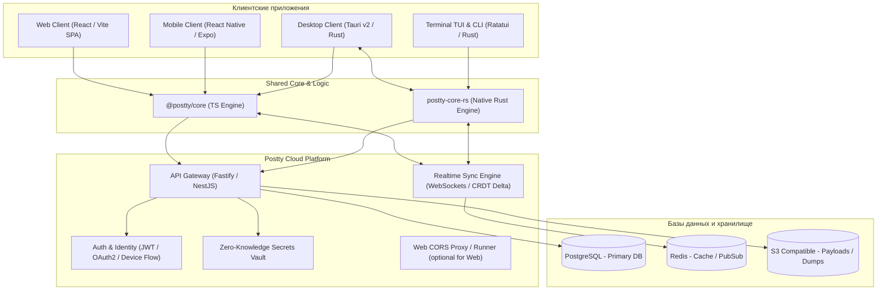
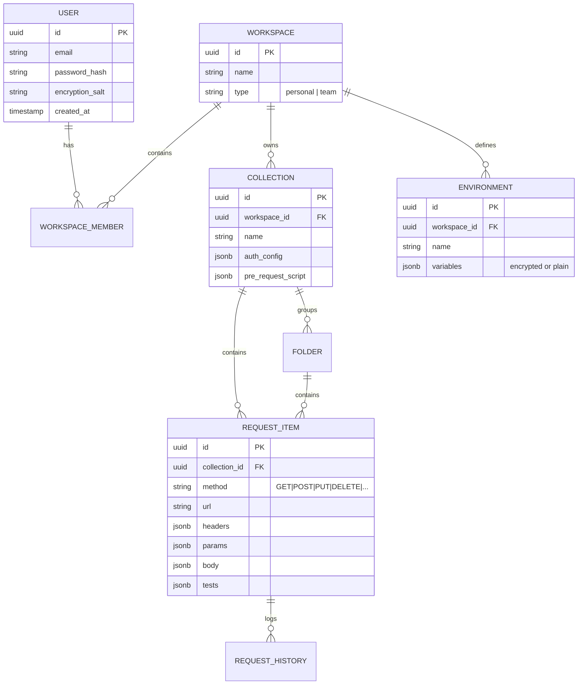

# Postty — План разработки аналога Postman

## 1. Введение и цели проекта

**Postty** — кроссплатформенный инструмент нового поколения для разработки, отладки и тестирования API (REST, GraphQL, WebSocket, SSE, gRPC). Проект нацелен на предоставление легкой, быстрой и приватной альтернативы Postman и Insomnia с поддержкой единой учетной записи, бесшовной облачной синхронизацией и концепцией **Offline-First**.

### Ключевые платформы
1. **Web (SPA/PWA)**: быстрый доступ из любого браузера без установки.
2. **Desktop (macOS, Windows, Linux)**: нативное приложение без ограничений браузера (прямые сокеты, обход CORS, работа с локальными сертификатами и прокси на базе Tauri v2).
3. **Mobile (iOS, Android)**: мобильный клиент для мониторинга API, быстрого тестирования, запуска коллекций и инспекции ответов на ходу (React Native / Expo).
4. **Terminal TUI & CLI (macOS, Linux, Windows)**: полноэкранное терминальное приложение с поддержкой клавиатуры и мыши, а также headless-раннер коллекций для CI/CD.
5. **Cloud Backend**: сервис авторизации, синхронизации конфигов, управления воркспейсами, историей и командным доступом.

---

## 2. Архитектурная концепция



### Принципы архитектуры
* **Offline-First**: данные (коллекции, запросы, переменные) хранятся локально (SQLite / IndexedDB) и мгновенно доступны без интернета на всех платформах.
* **CRDT (Conflict-free Replicated Data Types)**: автоматическое бесконфликтное слияние изменений между десктопом, терминалом, мобильным и веб-клиентом.
* **End-to-End Encryption (E2EE)** для секретов: переменные окружения с флагом `secret` (API ключи, токены) шифруются на клиенте мастер-ключом пользователя; сервер хранит только зашифрованный блоб.
* **Универсальный сетевой адаптер (Pluggable Transport Layer)**:
  * В Desktop и TUI: нативные HTTP/TCP вызовы через Rust (`reqwest`/`hyper`) без ограничений CORS, полная поддержка SSL-сертификатов, CA, mTLS, прокси.
  * В Mobile: нативные HTTP вызовы (Fetch / OkHttp / URLSession).
  * В Web: прямое обращение к API (при наличии CORS) либо через веб-расширение браузера / облачный прокси-сервер Postty.

---

## 3. Спецификация Terminal TUI & CLI приложения

Полноэкранный терминальный интерфейс проектируется как первоклассный клиент, не уступающий GUI-версиям по функционалу и удобству:

### 3.1. Интерактивный режим (TUI)
* **Полноэкранный рендеринг (Alternate Screen Buffer)**: чистый запуск в терминале без засорения истории шелла, автоматическое восстановление экрана при выходе (`q` или `Ctrl+C`).
* **Полноценная поддержка мыши**:
  * Клики по элементам дерева (выбор воркспейса, коллекции, папки, запроса).
  * Переключение табов кликом (`Params`, `Headers`, `Auth`, `Body`, `Tests`, `Response`).
  * Скролл колесиком мыши в списке запросов и в теле ответа/запроса.
  * Drag-to-resize (изменение размера сплит-панелей терминала мышью).
  * Выделение и копирование текста ответа.
* **Клавиатурная навигация**:
  * Быстрый переход по вкладкам (`1`–`6` или `Tab` / `Shift+Tab`).
  * Vim-навигация (`h`, `j`, `k`, `l`) по дереву коллекций и истории.
  * Глобальные хоткеи: `Ctrl+Enter` (Отправить запрос), `Ctrl+P` (Fuzzy Search по запросам/эндпоинтам), `Ctrl+E` (Смена Environment), `Ctrl+W` (Смена Workspace), `/` (Поиск по телу ответа).
* **Синтаксическая подсветка и форматирование**:
  * Форматирование JSON, XML, YAML, HTML с синтаксической раскраской (цветовые схемы: Dracula, Monokai, Catppuccin, Nord, System ANSI).
  * Сворачивание/разворачивание JSON-нод (Folding).

### 3.2. Авторизация и облачная синхронизация в TUI
* **Авторизация через OAuth Device Flow**:
  * Команда `postty login` генерирует одноразовый код и ссылку (`https://postty.dev/activate?user_code=WDJB-MJGN`), открывая браузер (подобно `gh auth login`).
  * Поддержка прямого логина по API-токену: `postty login --token <token>`.
* **Синхронизация**:
  * Локальный кэш хранится в `~/.local/share/postty/postty.db` (SQLite).
  * Фоновая синхронизация изменений по WebSockets с облаком Postty. Любые изменения запросов в TUI мгновенно отображаются на десктопе, вебе и мобилке.

### 3.3. Headless CLI режим (Automation / CI/CD)
* Запуск коллекций из командной строки (аналог Newman):
  ```bash
  postty run "My API Collection" -e "Production" --bail --reporters cli,junit
  ```
* Экспорт и конвертация форматов:
  ```bash
  postty import openapi.yaml
  postty export --collection "Billing" --format postman-v2.1 > collection.json
  ```

---

## 4. Стек технологий

| Уровень | Технологии | Обоснование |
|---|---|---|
| **Монорепозиторий** | **Turborepo + pnpm + Cargo Workspaces** | Объединение TypeScript (Web, Mobile, Backend) и Rust (Desktop Core, TUI CLI) в едином репозитории с кэшированием сборок. |
| **Terminal TUI** | **Rust (Ratatui + Crossterm + Tokio)** | Золотой стандарт современных TUI: мгновенный старт (<10ms), 60 FPS, нативная поддержка мыши и событий терминала, компиляция в единый легковесный бинарник `postty`. |
| **Desktop** | **Tauri v2 (Rust + React/TypeScript)** | Потребление памяти в 5–10 раз меньше Electron (~40MB против ~300MB), общие сетевые и крипто-модули на Rust с TUI. |
| **Web** | **React + Vite / TanStack Router + Tailwind CSS** | Моментальный HMR, высокая скорость работы UI с большими payload. |
| **Mobile** | **React Native (Expo)** | 90% переиспользование логики из `@postty/core` и общих UI-паттернов, нативный HTTP стек. |
| **Shared Core (TS)** | **TypeScript (`@postty/core`, `@postty/contracts`)** | Единый парсер запросов, движок тестов, валидация схем Zod. |
| **Shared Core (Rust)**| **`postty-core-rs`** | Общий нативный сетевой стек (reqwest, rustls, mTLS) и криптография для Tauri Desktop и TUI. |
| **Backend** | **Node.js (Fastify / NestJS) + TypeScript** | Асинхронная обработка высокой нагрузки, общая типизация Zod/tRPC с клиентами. |
| **Базы данных** | **PostgreSQL (Drizzle ORM) + Redis** | Надежное реляционное хранение воркспейсов, ролей, аудит-логов; Redis для WebSockets pub/sub. |
| **Локальное хранилище** | **SQLite (Desktop, TUI, Mobile) / IndexedDB (Web)** | Быстрая работа оффлайн и мгновенный полнотекстовый поиск. |

---

## 5. Модель данных и структура коллекций



---

## 6. Дорожная карта реализации (Roadmap)

### Этап 0: Фундамент и архитектурная подготовка (Недели 1–2)
- [ ] Инициализация монорепозитория (Turborepo, pnpm workspaces, Cargo workspace для Rust крейтов).
- [ ] Настройка дизайн-системы: `@postty/ui` (Tailwind + Radix UI) и цветовой палитры терминала TUI.
- [ ] Определение кроссплатформенных схем данных и контрактов: `@postty/contracts`.
- [ ] Разработка общего Rust-крейта `postty-core-rs` (сетевой клиент, интерполяция переменных, локальный SQLite).

### Этап 1: Движок запросов и Web MVP (Недели 3–5)
- [ ] Разработка `@postty/core` (TypeScript) и синхронизация с `postty-core-rs`.
- [ ] Реализация Web-клиента:
  - Полноценный интерфейс создания и выполнения HTTP-запросов.
  - Локальное сохранение коллекций в IndexedDB.
  - Опциональный веб-прокси для обхода CORS.

### Этап 2: Бэкенд, единый аккаунт и облачная синхронизация (Недели 6–8)
- [ ] Бэкенд сервис:
  - Авторизация: JWT, Refresh tokens, OAuth (GitHub/Google), **OAuth 2.0 Device Authorization Grant (RFC 8628)** для CLI/TUI.
  - REST/tRPC API для воркспейсов, коллекций и сред.
- [ ] Realtime Sync Engine:
  - Двусторонняя синхронизация через WebSockets (дельта-патчи).
  - Безопасное хранилище E2EE секретов.

### Этап 3: Полноэкранный Terminal TUI & CLI (Недели 9–11)
- [ ] Разработка TUI на **Ratatui + Crossterm**:
  - Alternate Screen рендеринг с тремя основными панелями: дерево коллекций/истории (слева), конфигуратор запроса (сверху-справа), инспектор ответа (снизу-справа).
  - Обработка мыши: клики по дереву и табам, скролл, ресайз разделителей.
  - Подсветка синтаксиса ответов (syntect / ratatui highlight).
- [ ] CLI команды:
  - `postty login` (Device Code Flow).
  - `postty run <collection>` (CI/CD runner с выводом отчетов).
  - `postty sync` (принудительная синхронизация).

### Этап 4: Нативное десктопное приложение (Недели 12–14)
- [ ] Конфигурация Tauri v2 (macOS, Windows, Linux).
- [ ] Интеграция `postty-core-rs` в качестве бэкенда десктопа (обход CORS, системные прокси, SSL-сертификаты).
- [ ] Автообновления (Tauri Updater), сборка DMG, MSI, DEB.

### Этап 5: Мобильное приложение (Недели 15–17)
- [ ] Создание приложения на React Native (Expo).
- [ ] Адаптивный мобильный UI: запуск тестов на ходу, переключение Environment, инспекция логов.
- [ ] Биометрия (FaceID / Fingerprint) и оффлайн-кэш на SQLite.

### Этап 6: Расширенные протоколы и командные фичи (Недели 18–21)
- [ ] Поддержка GraphQL, WebSocket, SSE, gRPC во всех клиентах (Web, Desktop, Mobile, TUI).
- [ ] Pre-request и Test-скрипты в изолированной JS-песочнице.
- [ ] Импорт/экспорт: Postman v2.1, OpenAPI 3.0/3.1, cURL, Insomnia.
- [ ] Team Workspaces и RBAC.

---

## 7. Безопасность и хранение конфигов

1. **Единая авторизация на всех 4 платформах**:
   - Web / Desktop / Mobile: стандартный Web / OAuth / Passkeys поток.
   - TUI / CLI: Device Code Flow (`postty login`) с открытием браузера и подтверждением одноразового кода.
   - Токены на клиентах хранятся в защищенных хранилищах (OS Keychain / Secret Service / SecureStore).
2. **Безопасность API-токенов (Zero-Knowledge E2EE)**:
   - Секретные переменные шифруются AES-256-GCM на устройстве пользователя.
   - Ни веб-сервер, ни сторонние наблюдатели не имеют доступа к расшифрованным секретам.
3. **Безопасность сетевого слоя**:
   - TLS 1.3, строгая валидация SSL (с возможностью отключения для локальной разработки `localhost` в Desktop и TUI).
